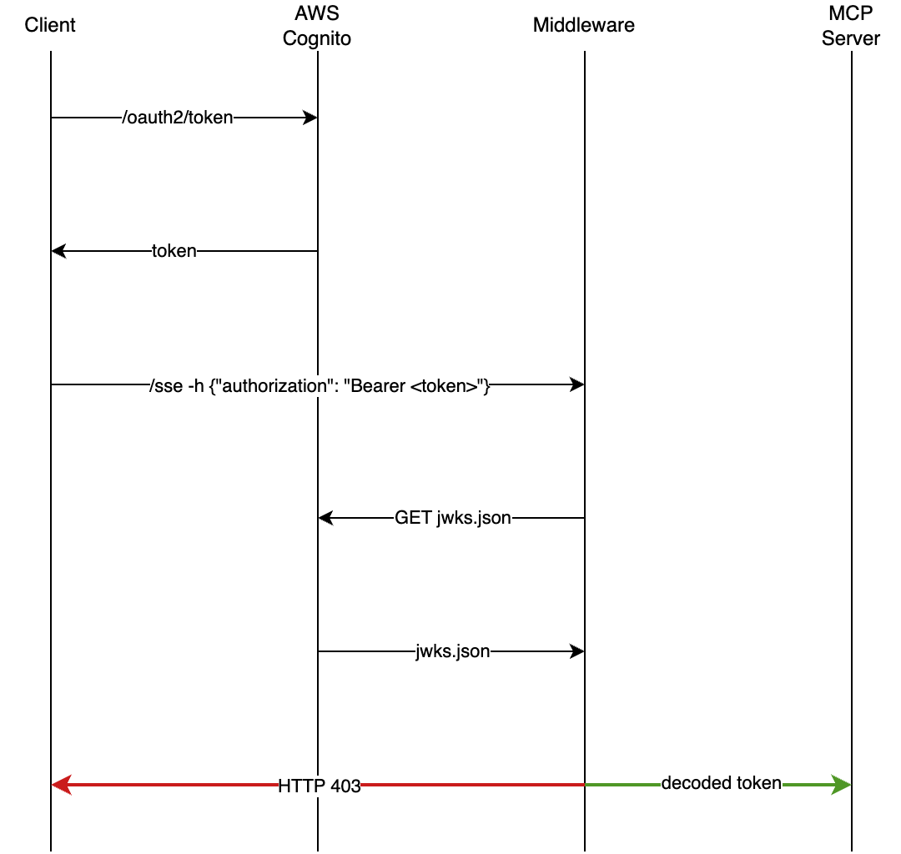

# FastMCP Authentication Middleware

This is a simple authentication middleware for FastMCP that uses JWT tokens for user 
authentication. 

AWS Cognito is used as the identity provider, from which users authenticate and receive
a JWT token. The requested token is then passed in the `Authorization` header 
of the request to the FastMCP server. The server then verifies the token using 
the public key from AWS Cognito.


## Pre-requisites

You will need to create a Cognito user pool and a user pool client in AWS then set
the following environment variables:

Create a `.env` file in the root directory with the following variables:

```env
USER_POOL_CLIENT_ID=<YOUR_USER_POOL_CLIENT_ID>
USER_POOL_CLIENT_SECRET=<YOUR_USER_POOL_CLIENT_SECRET>
```

## Starting the server

```bash
uv sync
source .venv/bin/activate
```

This will create a virtual environment and install all the required packages.

```bash
python src/mcp_services/auth_mcp/server.py
```

## Testing the server

```bash
python src/test.py
```
